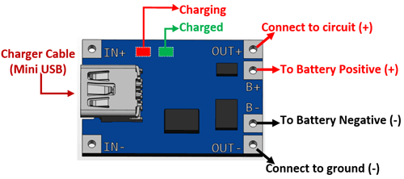
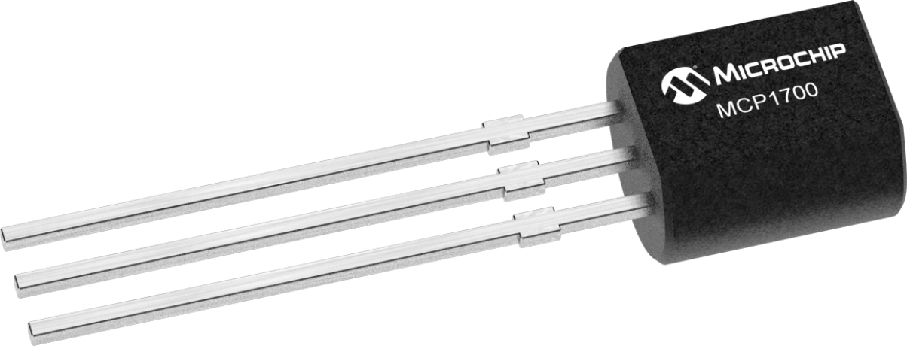

# Covid-Vaccination-Counter-Dual-Display

ESP32 Dev Kit v1 with two OLED screens running Micropython, displaying Covid Vaccination Statistics retrieved from a public API.


## Why?
I am trying to learn new things and there is no better way to learn new things than by doing it. What I wanted to do was create a little clock that would display some Covid related statistics, specifically the number vaccines that have been distributed and the number of people that have been vaccinated.

## How?
I am going to use a basic ESP32 based Dev Kit with two OLED screens and battery power it. It will connect to a Public API to retrieve the COVID vaccination statistics and display it on the screen.

When I started this project there was no public API available with the COVID Vaccination statistics so for this purpose of this project I manually retrieve the data from the CDC website and add it to a JSON Rest Server that I will connect to from the ESP32. For more information on how to set that up you can check this out my article on [How to setup a JSON REST API Server on Heroku](https://cashoefman.com/how-to-setup-a-json-rest-api-server-on-heroku) or take a look at my Github Repo, [How to setup a local and remote JSON REST API Server in ten-ish easy steps](https://github.com/cashoefman/my-api-server).

For now you could just use [my JSON Server](https://my-json-server.typicode.com/cashoefman/api-server/counts) for it but I am not sure how long that will keep working. 
### Hardware Setup

1. ESP32 Dev Kit v1
2. .96" OLED Display
3. Micro Switch
4. A Li-Ion Battery
5. TP4056A Li-Ion Battery Charging Module
6. MCP1700-3302E Voltage Regulator
7. 1000uF 16V electrolytic capacitor and a 100nF ceramic capacitor
8. 82K Ohm and 28K ohm resistors

I will provide this [Fritzing diagram](Images/Covid%20Clock.fzz) for the setup. However I don't guarantee anything and am not very experienced with electronics so don't blame me if the diode on your ESP32 Dev board starts smoking or you blow up the USB port on your brand new Mac Book M1.


##### 1. ESP32 Dev Kit v1
The ESP32 Dev Kit v1 is a fairly standard dev board, you can buy one on Amazon for a around $10. We will start by putting it in a breadboard. I made it look nice in the Fritzing Diagram but you might notice that in the image I am using two breadboards, the module is just slightly to wide! for the breadboard. I have heard there are some breadboards with 6 pins but I've not seen any for sale.


##### 2. .96" OLED Display
The .96" I2C OLED displays you can also get on Amazon for $3 to $5 each. I bought a set of 4 from Makerfocus.


Note that in order for the displays to work you have to change the address of the second display. On the displays I used you can do that by moving the "IIC Adress Select" SMD Resistor. It is a little tricky but with a decent standard soldering iron you get this done. 

##### 3. Micro Switch
The switch makes it easy to reset the board if needed. If you pull the EN pin to ground the board reboots.

##### 4. A Li-Ion Battery
Whatever you have lying around should work. This is where it get a little tricky though. The battery that I used when fully charged outputs 4.2v and I am planning on powering the board through the 3.3v pin. So we need to reduce the power to no more than 3.3v or you will see magic blue smoke coming from the board! More on that in 6.

##### 5. TP4056A Li-Ion Battery Charging Module
I had a few of these laying around so repurposed one so I didn't have to deal with anything around designing something for that.



##### 6. MCP1700-3302E Voltage Regulator
Tons of options here but again I had a few of these so I figured I'd use them. This module takes the output voltage from the Li-On battery and reduces it to 3.3v


##### 7. Capacitors
To stabalize the output, as I understand it you have to add capacitors over the output and ground pin of the voltage regulator. I added a 1000uF 16V electrolytic capacitor and a 100nF ceramic capacitor

##### 8. 82K Ohm and 28K ohm resistors
And because I want to be able to measure the output of the battery and use that in my code to later to display the battery 100% we need to bring back the range of the voltage that we are going to measure to 0-3.3v. 

The ADC on the board can measure different voltage ranges, 0-1v or 0-3.3v and you will see in the code how you can set what the range is that the ADC will measure.
   
We adjust the voltage range by adding resistors between Ground and the ADC pin and the battery output line the ADC Pin.

You can calculate the resistor values with this formula:
```
Vout = (4.2*82k)/(22k + 82k) = 3.3V
```
I used 22K and 82K just because I could find those quickly in my pile of resistor.

### Software Setup

The base setup for your device is the same as I have described before [here](https://github.com/cashoefman/ESP32-BME680-uPy). Once you have your board configured with MicroPython upload the following files from the Git Repo
```
main.py
ssd1306.py
gfx.py
config.py
```
And you are set!
#### config.py
The Git Repo has a file called `example.config.py` just rename that file to `config.py` and update it with your Wifi SSID and Password.

Depending on the ESP 32 board you use and how you wire it you can also update the PINS for any onboard or remote LED and the PIN for the ADC reading the voltage of the battery.

[Kyle Redelinghuys](https://twitter.com/ksredelinghuys)) at the [Covid 19 API](https://covid19api.com) said he will be adding COVID Vaccination Statistic data to his API, once he does that, I will add information on how to use that API. But for now you can use my JSON Server. For this you will also have to update the API_URL to: `https://my-json-server.typicode.com/cashoefman/api-server/counts`.
#### ssd1306.py
This is the driver for the OLED screens
#### gfx.py
This is a library that I used to draw the battery indicator and the timer at the bottom of each OLED screen.
#### main.py
This is your main "application". Refer to the file itself for fairly detailed comments on what each line does.
